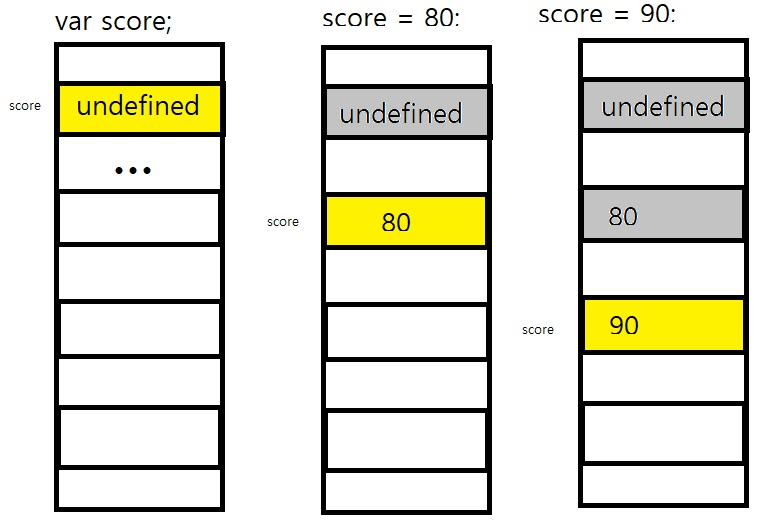
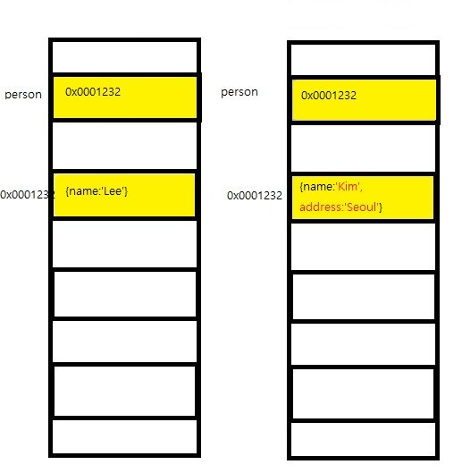

# 11장 원시 값과 객체의 비교
6장 데이터 타입에서 살펴본것처럼 7가지 데이터 타입 (숫자, 문자열, 불리언, null, undefined, 심벌, 객체 타입)은 크게 원시 타입과 객체 타입으로 구분할 수 있음
구분 이유는? -> 객체 타입은 3가지 측면에서 다름
- 원시 타입의 값은 변경 불가능한 값 / 객체(참조) 타입의 값은 변경 가능한 값
- 원시 값을 변수에 할당하면 변수(확보된 메모리 공간)에는 실제 값 저장 / 객체를 변수에 할당하면 변수에는 참조 값 저장
- 원시 값을 갖는 변수를 다른 변수에 할당하면 원본의 원시 값이 복사되어 전달. 값에 의한 전달(pass by value) / 객체 가리키는 변수를 다른 변수에 할당하면 원본의 참조 값이 복사되어 전달 참조에 의한 전달(pass by reference)

## 11.1 원시 값
# 11.1.1 변경 불가능한 값
원시 타입primitive type의 값. 원시 값은 변경 불가능한 값immutable value, 한번 생성된 원시 값은 읽기 전용 read only 값으로서 변경할 수 없다.

> 값을 변경할 수 없다는것?
>> 변수와 값을 구분하여 생각하면
>> 변경 불가능하다는 것은 변수가 아니라 값에 대한 진술
>> <font color=red>변수</font> : 하나의 값을 저장 하기 위해 확보한 메모리 공간 자체 또는 그 메모리 공간을 식별하기 위해 붙인 이름
>> <font color=red>값</font> : 변수에 저장된 데이터로서 표현식이 평가되어 생성된 결과

원시 값은 변경 불가능하다 -> 원시 값 자체를 변경할 수 없다는 것이지 변수 값을 변경할 수 없다는 것이 아니다. 변수는 언제든지 재할당을 통해 변수값을 변경(교체) 할 수 있다.
상수는 재할당이 금지된 변수를 말한다. 상수도 값을 저장하기 위한 메모리 공간이 필요 하므로 변수라고 할 수 있다. 상수는 값의 교체 불가능하다

```js
// const 키워드를 사용해 선언한 변수는 재할당이 금지된다. 상수는 재할당이 금지된 변수일 뿐이다.
const o = {};

// const 키워드를 사용해 선언한 변수에 할당한 원시 값은 변경할 수 없다.
// 하지만 const 키워드를 사용해 선언한 변수에 할당한 객체는 변경할 수 있다.
o.a = 1;
console.log(o); // {a:1}
```

원시 값은 변경 불가능한 값. 즉 읽기 전용 값이다. 원시 값은 어떤 일이 있어도 불변한다. 이러한 원시 값의 특성은 데이터의 신뢰성을 보장한다.

4.5절 "값의 할당"에서 살펴보았듯이 원시 값을 할당한 변수에 새로운 원시 값을 재할당하면 메모리 공간에 저장되어 있는 재할당 이전의 원시 값을 변경하는 것이 아니라 새로운 메모리 공간을 확보하고 재할당한 임시 값을 저장한 후. 변수는 새롭게 재할당한 원시 값을 가리킨다. 이때 변수가 참조하던 메모리 공간의 주소가 바뀐다.



> 불변성 : 원시 값을 재할당하면 새로운 메모리 공간을 확보하고 재할당한 값을 저장한 후, 변수가 참조하던 메모리 공간의 주소를 변경한다.

*불변성을 갖는 원시 값을 할당한 변수는 재할당 이외에 변수 값을 변경할 수 있는 방법이 없다.*
만약 재할당 이외에 원시 값인 변수 값을 변경할 수 있다면 예기치 않게 변수 값이 변경될 수 있다는것을 의미하고 이는 값의 변경, *상태 변경을 추적하기 어렵게 만든다.*


### 11.1.2 문자열과 불변성
6.9.1절 "데이터 타입에 의한 메모리 공간의 확보와 참조" 원시 값을 저장하려면 먼저 확보해야 하는 메모리 공간의 크기를 결정해야 한다. 이를 위해 원시 타입별로 메모리 공간의 크기가 미리 정해져 있다.
ECMAScript 사양에 문자열 타입(2바이트) 숫자 타입(8바이트) 이외의 원시 타입은 크기를 명확히 규정하고 있지 않고, 브라우저 제조사의 구현에 따라 원시 타입의 크기는 다를 수 있다.

원시 값인 문자열은 다른 원시 값과 비교할 때 독특한 특징이 있다. 문자열은 0개 이상의 문자로 이뤄진 집합
숫자는 8바이트

c는 문자열 타입은 존재 하지 않는다.
자바는 문자열을 string 객체로 처리
자바스크립트는 개발자의 편의를 위해 문자열 타입 제공

문자열은 이터러블이며, 배열과 유사하게 각 문자에 접근가능
> 유사 배열 객체
>> 유사 배열 객체란 마치 배열처럼 인덱스로 프로퍼티 값에 접근할 수 있고 length 프로퍼티를 갖는 객체 문자열은 배열처럼 인덱스를 통해 각 문자에 접근할 수 있으며 length 프로퍼티를 갖기 때문에 유사 배열 객체, for 문으로 순회할 수 있다.

```js
var str = 'string';
str[0];
str.length;
str.toUpeerCase();
```
원시 값을 객체 처럼 사용하면 원시 값을 감싸는 래퍼 객체로 자동 변환
21.3 "원시 값과 래퍼 객체"

```js
var str = 'string';
str[0] = 'S'; // 문자열은 원시 값이므로 변경 할 수 없다.
console.log(str); // string
```

### 11.1.3 값에 의한 전달
```js
var score = 80;
var copy = score;
score = 100;
console.log(score);
console.log(copy); // ?
```
copy는 score의 값이 복사되어 할당된다.
*score 변수와 copy 변수의 값은 다른 메모리 공간에 저장된 별개의 값이다.*

```js
var score = 80, copy = score;
console.log(score, copy);
console.log(score === copy); // true
score = 100;
console.log(score, copy);
console.log(score === copy); // false
```

사실 책의 그림은 자바스크립트 엔진의 내부 동작과 정확히 일치 하지 않습니다. ECMAScript 사양에 변수를 통해 메모미를 어떻게 관리해야 하는지 명확히 정의되지 않았씁니다. 제조사에 따라 실제 내부 동작은 차이가 있을 수 있습니다.

하지만 변수에 원시 값을 갖는 변수를 할당하는 시점에는 두 변수가 같은 원시 값을 참조하다가 어느 한쪽의 변수에 재할당이 이뤄졌을 때 비로소 새로운 메모리 공간에 재할당된 값을 저장하도록 동작할 수도 있습니다.
(파이썬은 이 처럼 동작합니다.)

ECMAScript에는 "값에 의한 전달" 용어는 없습니다.
엄밀히는 *변수와 같은 식별자는 값이 아니라 메모리 주소를 기억하고 있기 때문*
4.2 "식별자"에서 언급한 바와 같이 식별자는 어떤 값을 구별해서 식별해낼 수 있는 고유한 이름입니다. 값은 메모리 공간에 저장되어 있습니다. 따라서 식별자는 메모리 공간에 저장되어 있는 어떤 값을 구별해서 식별해낼 수 있어야 하므로 변수와 같은 식별자는 값이 아니라 메모리 주소를 기억하고 있습니다.
```js
var x = 10;
```
숫자 리터럴 10에 의해 생성된 숫자 값 10이 저장된 메모리 공간의 주소를 전달합니다. 이로써 식별자 x는 메모리 공간에 저장된 숫자 값 10을 식별할 수 있습니다.
```js
var copy = score;
```
score는 식별자 표현식으로서 숫자 값 80으로 평가되며, 이때 두가지 평가 방식이 가능합니다.
1. 새로운 80을 생성해서 메모리 주소를 전달 하는 방식 할당 시점에 두 변수가 기억하는 메모리 주소가 다릅니다.
2. score 변수값 80의 메모리 주소를 그대로 전달하는 방식. 이 방식은 할당 시점에 두 변수가 기억하는 메모리 주소가 같습니다.

이처럼 "값의 의한 전달"도 사실은 값을 전달하는 것이 아니라 메모리 주소를 전달합니다. 단, 전달된 메모리 주소를 통해 메모리 공간에 접근하면 값을 참조할 수 있습니다.

중요한것은 재할당하는 시점이든 결국은 두 변수의 원시 값은 서로 다른 메모리 공간에 저장된 별개의 값이 되어 어느 한쪽에서 재할당을 통해 값을 변경하더라도 서로 간섬할 수 없다는 것입니다.

## 11.2 객체
프로퍼티의 개수가 정해져 있지 않으며, 동적으로 추가되고 삭제할 수 있습니다. 값에도 제약이 없습니다. 객체는 원시 값과 같이 확보해야 할 메모리 공간의 크기를 사전에 정해 둘 수 없습니다.
복합적인 자료구조이므로 객체를 관리하는 방식이 원시 값보다 복잡하고 구현 방식도 제조사마다 다를 수 있습니다. 원시 값은 상대적으로 적은 메모리를 소비하지만 객체는 경우에 따라 크기가 매우 클 수도 있습니다. 객체를 생성하고 프로퍼티에 접근하는 것도 원시 값과 비교할 때 비용이 많이 드는 일입니다. 따라서 객체는 원시 값과 다른 방식으로 동작하도록 설계되어 있습니다.

> 자바스크립트 객체의 관리 방식
>> 객체는 프로퍼티 키를 인덱스로 사용하는 해시 테이블(연관 배열 associative array, map, dictionary, lookup table이라고 부르기도 합니다.) 이라고 생각할 수 있습니다. 대부분 자바스크립트 엔진은 해시 테이블과 유사하지만 높은 성능을 위해 일반적인 해시 테이블보다 나은 방법으로 객체를 구현합니다.
>> key -> hash function -> buckets

> c++, 자바는 클래스를 기반으로 객체(인스턴스)를 생성하지만, 자바스크립트는 클래스 없이 객체를 생성할 수 있으며 객체가 생성된 이후라도 동적으로 프로퍼티와 메서드를 추가할 수 있습니다. 성능적으로는 생성과 프로퍼티 접근에 비용이 더 많은 비효율적인 방식입니다.

> v8 자바스크립트 엔진에서는 프로퍼티에 접근하기 위해 동적탐색dynmaic lookup 대신 히든 클래스hidden class라는 방식을 사용해 c++ 객체의 프로퍼티에 접근하는 정도의 성능을 보장합니다. 히든 클래스는 자바와 같이 고정된 객체 라이아웃과 유사하게 동작합니다.
> 참조할 refer들은 책

### 11.2.1 변경 가능한 값
객체(참조) 타입의 값. 즉 객체는 변경 가능한 값mutable value 입니다.
```js
var person = {
    name: 'Lee'
}
```
객체를 할당한 변수가 기억하는 메모리 주소를 통해 메모리 공간에 접근하면 참조 값reference value에 접근할 수 있습니다. 참조 값은 생성된 객체가 저장된 메모리 공간의 주소 그 자체입니다.
변수 -> 객체의 주소값 -> 객체 메모리
```js
var person = {
    name: 'Lee'
}
console.log(person); // {name:"lee"}
```
객체를 할당한 변수는 변수는 객체를 참조하고 있다 또는 변수는 객체를 가리키고 있다. 라고 표현합니다.

원시 값은 변경 불가능. 원시변수의 값을 변경하려면 재할당
객체는 변경 가능한 값. 객체변수는 재할당 없이 객체를 직접 변경
재할당 없이 프로퍼티 동적 추가, 프로퍼티 값 갱신, 프로퍼티 삭제 가능

```js
var person = {
    name: 'Lee'
}
person.name = 'Kim';
person.address = 'Seoul';
console.log(person); // {name:"lee"}
```

객체를 생성하고 관리하는 방식은 매우 복잡하고 비용이 많이 듬으로 객체를 변경 할때마다 이전값을 복사해서 새롭게 생성한다면 명확하고 신뢰성이 확보되겠지만 객체는 크기가 매우 클수도 있고, 원시 값처럼 크기가 일정하지도 않으며, 프로퍼티 값이 객체일 수도 있어서 복사해서 생성하는 비용이 많이 든다. 다시 말해 메모리의 효율적 소비가 어렵고 성능이 나빠진다.
따라서 메모리를 효율적으로 사용하기 위해. 그리고 객체를 복사 생성하는 비용을 절약하여 성능 향상시키기 위해 객체는 변경 가능한 값으로 설계되어 있다. 메모리 사용의 효율성과 성능을 위해 어느정도의 구조적인 단점을 감안한 설계라고 할 수 있다. *원시값과 다르게 여러개의 식별자가 하나의 객체를 공유할 수 있다*

> 얕은 복사 깊은 복사
>> 얕은복사 : 한단계 까지만 복사 / 깊은복사 : 중첩되어 있는 객체까지 모두 복사
```js
const o = { x: { y: 1 } };
// 얕은 복사
const c1 = { ...o }; // 스프레드 문법 35장
console.log (c1 === o); // false
console.log (c1.x === o.x); // true

// lodash의 cloneDeep을 사용한 깊은 복사
// "npm install lodash", Node.js 환경에서 실행
const _ = require('lodash');
// 깊은 복사
const c2 = _.cloneDeep(o);
console.log(c2 === o ); // false
console.log(c2.x === o.x); // false
```

### 11.2.2 참조에 의한 전달
```js
var person = { name : 'Lee'}
copy = person
```
참조값이 복사되어 전달 참조에 의한 전달

두개의 식별자가 하나의 객체를 공유
참조에 의한 전달이든 값에 의한 전달이든 공유에의한 전달이든 다 ECMAScript에 나오는 공식적 용어는 아닙니다.
다만 자바스크립트에 포인터가 없기 때문에 다른 언어에서 사용하는 참조에 의한 전달과 정확히 일치 하지는 않고 최대한 설명을 돕기위해 사용하는 것뿐입니다.

마지막 퀴즈
```js
var person1 = {
    name: 'lee'
}
var person2 = {
    name: 'lee'
}
person1 === person2 // ?
person1.name === person2.name // ?
```
f/t

p137~153
p153~168 함수 12.4